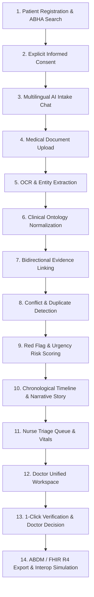

# MediKiosk System Architecture Document

## 1. Executive Summary

MediKiosk is an intelligent, multi-tenant clinical intake and triage assistance platform designed for the Smart India Hackathon (SIH) 2026.

MediKiosk's guiding clinical philosophy is:
> **"AI collects. AI structures. AI highlights. The doctor decides."**

MediKiosk operates as an assistive documentation layer. It does **not** diagnose conditions, prescribe treatments, or act as an autonomous clinician. All diagnostic decisions and orders remain with the attending medical officer.

---

## 2. End-to-End Canonical Intake Pipeline

MediKiosk standardizes the intake journey across a 14-stage deterministic pipeline:



### Stage Breakdown:
1. **Patient Registration & ABHA**: Demographics, language preferences, emergency contact, accessibility preferences.
2. **Informed Consent**: Explicit opt-in capturing purpose (`CLINICAL_INTAKE`), specific data scopes (`history`, `uploaded_documents`, `structured_facts`), and timestamp.
3. **Multilingual AI Intake Chat**: Conversational engine in English, Hindi, and Telugu using local LLM/rules to extract structured symptoms, duration, onset, and severity.
4. **Document Capture**: High-resolution camera/file upload for prescriptions, discharge summaries, and lab reports.
5. **OCR & Entity Extraction**: Bounding box extraction of medication lines, dosages, clinical diagnoses, and abnormal lab values with clinician advisories.
6. **Clinical Ontology Normalization**: Maps extracted free-text to standard domains (`CHIEF_COMPLAINT`, `SYMPTOM`, `PAST_MEDICAL_HISTORY`, `MEDICATION`, `ALLERGY`, `LAB_RESULT`).
7. **Bidirectional Evidence Linking**: Every structured fact maintains a pointer back to its primary origin—either conversation message ID or document OCR bounding box coordinates.
8. **Conflict & Duplicate Detection**: Identifies cross-source contradictions (e.g. Patient claims "No allergies" while an uploaded prescription notes "Penicillin hypersensitivity").
9. **Risk & Red Flag Urgency**: Keyword and vitals rules trigger triage priority levels (`EMERGENCY_ESCALATION`, `HIGH_PRIORITY_REVIEW`, `ROUTINE_QUEUE`).
10. **Timeline & Narrative Story**: Chronological aggregation of past encounters, current episode onset, and synthesized patient narrative.
11. **Nurse Triage Queue**: Real-time queue displaying priority, chief complaint, token number, and vitals recording interface.
12. **Doctor Unified Workspace**: Comprehensive clinical dashboard showing synthesized story, structured facts, interactive evidence viewer, and lab abnormalities.
13. **1-Click Clinical Verification**: Attending clinician reviews AI extractions, confirming or rejecting each fact with optional clinician notes (`DOCTOR_VERIFIED` / `REJECTED`).
14. **ABDM / FHIR R4 Export**: Generates a standard FHIR R4 Collection Bundle containing Patient, Encounter, Consent, Condition, MedicationStatement, AllergyIntolerance, Observation, and Composition resources.

---

## 3. Provenance & Evidence Model

MediKiosk prevents "black-box AI" risks by enforcing strict bidirectional provenance for every structured data point:

```
[ MedicalFact ]
      │
      ├── source_type: "CONVERSATION" ──► [ ConversationMessage ] (Role: PATIENT, verbatim text)
      │
      └── source_type: "DOCUMENT"     ──► [ DocumentEntity ] ──► [ OCRBlock ]
                                              (page_number, bbox: [x0, y0, x1, y1])
```

### Fact Verification States:
- `AI_EXTRACTED`: Automatically extracted by the NLP/OCR engine; pending review.
- `NEEDS_VERIFICATION`: Highlighted as having conflicting sources or low extraction confidence.
- `DOCTOR_VERIFIED`: Explicitly confirmed and signed off by the clinician.
- `REJECTED`: Discarded by the clinician as inaccurate or irrelevant.

---

## 4. Security & Isolation Architecture

```
                                  [ Client Browser ]
                                          │
                                 HTTPS + Bearer JWT
                                          ▼
                         [ FastAPI Gateway (CORS + RBAC) ]
                                          │
            ┌─────────────────────────────┼─────────────────────────────┐
            ▼                             ▼                             ▼
   [ require_role() ]           [ File Storage Sandbox ]        [ Audit Service ]
   PATIENT_KIOSK, NURSE,        Strict canonical base dir       Immutable event trail
   DOCTOR, ADMIN                path traversal protection       for all state mutations
            │                             │                             │
            └─────────────────────────────┼─────────────────────────────┘
                                          ▼
                          [ PostgreSQL (Supabase / Local) ]
                                          │
                        [ Row Level Security (RLS) Policies ]
                        - Staff restricted to department/tenant
                        - Kiosk restricted to active session
                        - Audit records append-only
```

---

## 5. ABDM / FHIR Interoperability Mapping

MediKiosk exports complete FHIR R4 Collection Bundles with strict schema adherence:

| Internal Model | FHIR R4 Resource | Key Mappings |
|---|---|---|
| `Patient` | `Patient` | `id`, `identifier` (MRN/ABHA), `name`, `gender`, `telecom`, `communication` |
| `IntakeSession` | `Encounter` | `class: AMB`, `status: finished`, `period.start/end` |
| `Consent` | `Consent` | `scope: patient-privacy`, `category: CLINICAL_INTAKE`, `policyRule` |
| `MedicalFact` (Complaint/Symptom/Hx) | `Condition` | `clinicalStatus: active`, `verificationStatus: confirmed/provisional`, internal provenance extension |
| `Medication` | `MedicationStatement` | `medicationCodeableConcept`, `status: active`, provenance extension |
| `Allergy` | `AllergyIntolerance` | `clinicalStatus: active`, `verificationStatus: confirmed`, `code` |
| `DocumentEntity` (Lab Result) | `Observation` | `category: laboratory`, `valueQuantity`, `referenceRange`, `interpretation` (L/H) |
| `IntakeSummary` / Story | `Composition` | `type: LOINC 34117-2` (History & Physical), Clinical Decision Notice, narrative sections |
